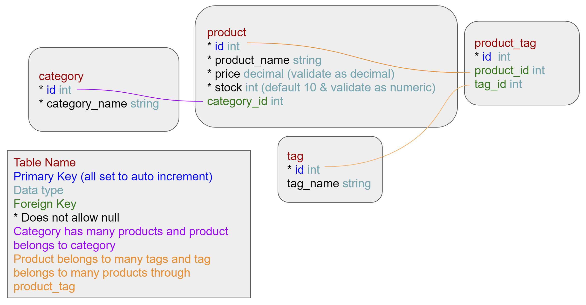

# E-Commerce-Back-End

## Description
dafdas

## Table of Contents
- [Installation](#installation)
- [Usage](#usage)
- [Contributing](#contributing)
- [Contact](#contact)

## Installation
Download code from the GitHub repository. Have Node.js installed. Link to Node.js downloads: https://nodejs.dev/en/download/. In a terminal input npm init -y. Then in the terminal install express, dotenv, sequilize, and mysql2 by inputting npm install.

## Usage
First the user has to enter mysql information in the .env.EXAMPLE file and change it's name to just .env. This will allow the application to connect with the mysql server.

The user will then need to source it's database. In the terminal type in mysql -u -p. Enter password and then type in source db/schema.sql and then exit. To create tables input node seeds.

Video demonstration:

## Contributing
Author: Xandromus from the Rice Coding Bootcamp

April 28, 2020

Source code: JavaScript
https://github.com/coding-boot-camp/fantastic-umbrella/tree/main

Packages used:

 Express: https://www.npmjs.com/package/express

 dotenv: https://www.npmjs.com/package/dotenv

 sequelize: https://www.npmjs.com/package/sequelize

 mysql2: https://www.npmjs.com/package/mysql2

## Contact
GitHub profile: https://github.com/CYMcolor

